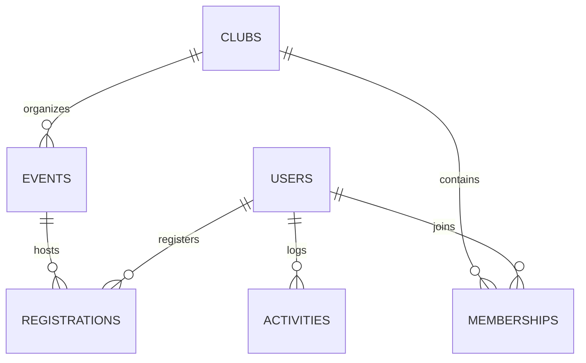

# 🛠️ Architecture & Technical Reference

This guide provides a detailed technical reference for the **UniEvent** web portal. It covers the client-side system architecture, the mock relational database schemas, the core styling design tokens, and functional JavaScript components.

---

## 1. Client-Side MVC Architecture

UniEvent functions as a client-side Model-View-Controller (MVC) application. It simulates database transactions and authentication checks directly in the browser.

```text
  ┌────────────────────────────────────────────────────────┐
  │                         VIEW                           │
  │   - HTML5 Pages (index, dashboard, events, clubs...)   │
  │   - CSS3 Layout & Glassmorphism Design Tokens          │
  └───────────────────────────┬────────────────────────────┘
                              │ Registers Event Listeners
                              ▼
  ┌────────────────────────────────────────────────────────┐
  │                      CONTROLLER                        │
  │   - app.js (Auth guards, Modals, Particles, Toasts)    │
  │   - events.js (Explorer logic, joins, creators)        │
  │   - dashboard.js (Widgets, Calendar generation)        │
  └───────────────────────────┬────────────────────────────┘
                              │ Queries / Updates
                              ▼
  ┌────────────────────────────────────────────────────────┐
  │                         MODEL                          │
  │   - db Client Wrapper API                              │
  │   - localStorage JSON Data Persistence                 │
  └────────────────────────────────────────────────────────┘
```

*   **Model**: The data layer wraps around the browser's `localStorage` API (implemented via the global `db` helper in [app.js](file:///c:/Users/ASUS/workspace/Projects/unievent/js/app.js)). It manages database initialization, retrievals, and updates.
*   **View**: HTML pages with a responsive, glassmorphic layout system styled by [style.css](file:///c:/Users/ASUS/workspace/Projects/unievent/css/style.css), [animations.css](file:///c:/Users/ASUS/workspace/Projects/unievent/css/animations.css), and [dashboard.css](file:///c:/Users/ASUS/workspace/Projects/unievent/css/dashboard.css).
*   **Controller**: Event-driven JavaScript files ([app.js](file:///c:/Users/ASUS/workspace/Projects/unievent/js/app.js), [events.js](file:///c:/Users/ASUS/workspace/Projects/unievent/js/events.js), and [dashboard.js](file:///c:/Users/ASUS/workspace/Projects/unievent/js/dashboard.js)) that manage DOM rendering, routing guards, and user interactions.

---

## 2. Mock Database Relational Schemas

UniEvent initializes six data collections in `localStorage` as JSON arrays.



### 2.1 `uni_users` (User Accounts)
Stores accounts for Students, Club Leaders, and Administrators.
```json
{
  "id": "usr-1",
  "name": "Alex Mercer",
  "studentId": "ST-2024-001",
  "email": "student@unievent.com",
  "password": "password123",
  "faculty": "Engineering",
  "department": "Computer Science",
  "role": "student",
  "avatar": ""
}
```

### 2.2 `uni_clubs` (Campus Organizations)
```json
{
  "id": "club-1",
  "name": "Coding Club",
  "category": "Academic",
  "description": "Explore software development...",
  "logo": "💻",
  "members": 154
}
```

### 2.3 `uni_events` (Campus Events)
```json
{
  "id": "evt-1",
  "title": "UniHack 2026",
  "clubId": "club-1",
  "clubName": "Coding Club",
  "date": "2026-06-25",
  "time": "09:00",
  "venue": "Campus Innovation Hub",
  "category": "Academic",
  "description": "A 24-hour hackathon...",
  "image": "https://images.unsplash.com/photo-..."
}
```

### 2.4 `uni_memberships` (Club Memberships)
Tracks which students belong to which clubs.
```json
{
  "clubId": "club-1",
  "studentId": "usr-1",
  "joinedAt": "2026-05-10"
}
```

### 2.5 `uni_registrations` (Event Enrollments)
Tracks which students have registered for which events.
```json
{
  "eventId": "evt-1",
  "studentId": "usr-1",
  "registeredAt": "2026-05-12"
}
```

### 2.6 `uni_activities` (Dashboard Action Logs)
Used to display chronological feeds on the user's dashboard.
```json
{
  "studentId": "usr-1",
  "type": "event_register",
  "text": "Registered for UniHack 2026",
  "time": "2026-05-12T14:35:00Z"
}
```

---

## 3. JavaScript Component Implementation

### 3.1 Dynamic Month Calendar
The custom calendar (defined in [dashboard.js](file:///c:/Users/ASUS/workspace/Projects/unievent/js/dashboard.js#L248-L332)) renders the current month:
1.  Calculates month structure using `Date(year, month, 1).getDay()` (first day of the week) and `Date(year, month + 1, 0).getDate()` (total days in the month).
2.  Appends padding divs (`calendar-day empty`) to fill out leading days of the week grid.
3.  Cross-references the dates against the user's registrations (`uni_registrations` -> `uni_events`). Matches are marked with a `.has-event` class.
4.  Attaches click event listeners to show list summaries inside a popup modal.

### 3.2 Dynamic Modal Engine
The modal utility (`modalHelper` in [app.js](file:///c:/Users/ASUS/workspace/Projects/unievent/js/app.js#L123-L172)) generates custom popups:
*   Injects a overlay structure with custom title headers, HTML body templates, and action buttons.
*   Enables custom `onConfirm` callback hooks, passing a `closeModal` handler.
*   Fades in and out using class animations and removes the elements from the document body upon closing.

### 3.3 Toast Notification API
The global toast helper (`showToast` in [app.js](file:///c:/Users/ASUS/workspace/Projects/unievent/js/app.js#L77-L120)) displays non-blocking status updates:
*   Initializes a vertical container `.toast-container` at the bottom-right corner if not already present.
*   Constructs a notification block styled dynamically (`toast-success` or `toast-error`).
*   Transitions the card from off-screen using a spring cubic-bezier translation.
*   Dismisses the block automatically after 4 seconds using a slide fade-out.

### 3.4 Interactive Background Particle Canvas
The canvas particle generator (`initParticles` in [app.js](file:///c:/Users/ASUS/workspace/Projects/unievent/js/app.js#L358-L419)):
*   Initializes a fullscreen `<canvas id="particles-canvas">` element below all page content.
*   Maintains a vector pool of `40` particle objects.
*   Animates each coordinate frame-by-frame (`requestAnimationFrame`) by subtracting vertical offsets, simulating a gentle rising bubble effect.
*   Triggers canvas coordinate resets on window resize events to prevent distortion.

---

## 4. UI Variables & Glassmorphism Design Tokens

UniEvent defines layout design tokens inside `:root` in [style.css](file:///c:/Users/ASUS/workspace/Projects/unievent/css/style.css#L3-L35):

*   **Palette**: Primary Navy (`#1E40AF`), Secondary Blue (`#3B82F6`), Accent Amber (`#F59E0B`), Slate Background (`#F8FAFC`), and Slate Typography (`#1E293B`).
*   **Glassmorphism Properties**:
    *   `--glass-bg`: `rgba(255, 255, 255, 0.72)` for translucent container panels.
    *   `--glass-border`: `rgba(255, 255, 255, 0.55)` to establish fine outlines.
    *   `--glass-shadow`: A subtle drop-shadow to separate cards from the animated background.
    *   `backdrop-filter`: Applied as `blur(16px) saturate(190%)` to ensure readability over moving background components.
*   **Rounded Borders**: Controlled globally using `--radius-sm` (12px), `--radius-md` (20px), and `--radius-lg` (28px).
*   **Typography**: Outfits all text with Google Fonts `Poppins` (`300`, `400`, `500`, `600`, `700`) for visual hierarchy.

---

## 5. Security & Access Guards

### 5.1 Route Guards
The `authGuard` function (in [app.js](file:///c:/Users/ASUS/workspace/Projects/unievent/js/app.js#L350-L355)) checks if a student is logged in. If not, it redirects the browser to `login.html`, appending a query redirect parameter (`?redirect=...`) to return the user to their target page after authenticating.

### 5.2 Form Guards
The event creation page (`create-event.html`) runs role validation on load (in [events.js](file:///c:/Users/ASUS/workspace/Projects/unievent/js/events.js#L423-L432)):
```javascript
if (!user || (user.role !== 'leader' && user.role !== 'admin')) {
  showToast('Permission denied. Only Club Leaders and Administrators can create events.', 'error');
  setTimeout(() => { window.location.href = 'dashboard.html'; }, 2000);
  return;
}
```
This script acts as a client-side gatekeeper, preventing unauthorized users from accessing the page and redirecting them to safety.
