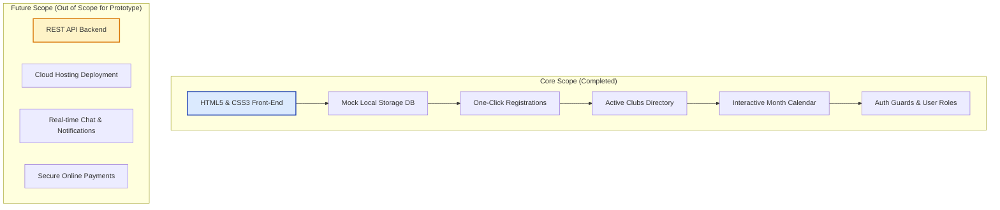

# 📋 Project Outline & Software Requirements Specification (SRS)

This document contains the project outline, target market definitions, problem statement, and a lightweight Software Requirements Specification (SRS) for **UniEvent** (originally conceived as *CampusConnect*).

---

## 1. Project Overview

*   **Project Title**: UniEvent (Evolved from CampusConnect)
*   **Project Type**: Lightweight Web-Based Event & Club Management Portal
*   **Main Objective**: To establish a clean, centralized digital campus hub where:
    1.  **Administrators and Club Leaders** can create, manage, and coordinate campus events and clubs.
    2.  **Students** can discover workshops, sports matches, cultural jams, and register/cancel attendance in seconds.
    3.  **Active Clubs** can maintain directories and recruit student members.

---

## 2. Target Market & Problem Statement

### Target Market
*   **Primary Users**: University students looking for activities, student club committees, society coordinators, and campus event organizers.
*   **Use Case Environment**: Campus department events, student club activities, academic workshops, guest lectures, varsity sports meets, cultural activities, and social festivals.

### Problem Statement
On modern university campuses, event information is highly fragmented. Activities are publicized via paper posters, multiple WhatsApp/Telegram group chats, social media feeds, or institutional emails. This disorganization causes:
*   **Low Student Turnout**: Students miss workshops or seminars simply because they were unaware of them.
*   **Coordination Bottlenecks**: Club leaders cannot easily estimate attendance or coordinate registrations.
*   **Dispersed Resources**: No single registry exists for active university clubs.

**UniEvent** resolves this by introducing a central digital portal. It provides a structured space for event publication, discovery, and one-click registrations.

---

## 3. Light Software Requirements Specification (SRS)

### 3.1 Functional Requirements

#### A. User & Authentication Module
*   **Guest Access**: Unauthenticated visitors can view the home page and browse the public directories of events and clubs.
*   **Authentication**: Users can sign up and log in via email and password.
*   **Role Management**: The system recognizes three user roles with distinct permissions:
    *   `student`: Can browse events/clubs, register for events, join clubs, and update their personal profile.
    *   `leader`: In addition to student actions, leaders can create events for their associated clubs.
    *   `admin`: Full control over directories, including event creation, management, and administrative privileges.

#### B. Event Explorer Module
*   **Creation & Lifecycle**: Club Leaders and Admins can create new events with fields for title, club organizer, date, time, venue, category, description, and event poster.
*   **Directory Browsing**: Students can view all events in a responsive card grid, showing visual posters, categories, organizers, and scheduling details.
*   **Search and Filters**: Real-time filtering by category (Academic, Cultural, Athletics), date-picker matches, and live title/venue keyword searching.
*   **Details Inspection**: Users can click any event title to open a comprehensive details modal showing full description and event details.

#### C. Registration & Club Enrollment Module
*   **One-Click Registration**: Authenticated students can register for events or cancel their registration, updating the events page and their dashboard instantly.
*   **Club Membership**: Students can join active campus clubs or leave them, which dynamically increments the club's member statistics.
*   **Dashboard Schedule**: Enrolled events are displayed on the user's dashboard table and automatically mapped onto a monthly calendar grid.

#### D. Personalization & Activity Logs
*   **Profile Manager**: Students can update their profile information (name, email, faculty, department).
*   **Dynamic Activity Feed**: A list on the dashboard tracking the user's recent actions (e.g., event registration, club enrollment) with relative time formatting (e.g., "3m ago", "1d ago").

---

### 3.2 Non-Functional Requirements

*   **Premium & Intuitive UI**: The frontend utilizes modern CSS variables, glassmorphic styling, responsive flex/grid layouts, smooth animations (page loaders, counts, hover scale shifts), and scroll reveals.
*   **Mobile-First Design**: The interface adapts to small screens, replacing desktop navigation with an interactive hamburger menu.
*   **Performance**: Fast, client-side rendering with no initial network delays, optimized by storing the database locally in JSON format.
*   **Accessibility & Legibility**: Strict color contrast definitions (e.g., Slate 600 color variables for muted text) ensure high text legibility (WCAG standards).
*   **Mock Security Structure**: Built-in auth guards and route redirections simulate production auth guards to restrict leader/admin page access.

---

## 4. System Users Matrix

| User Role | Navigation Permissions | Allowed Database Actions |
| :--- | :--- | :--- |
| **Visitor** | Home, Events, Clubs, Login, Sign Up | View public event/club cards, read metadata. |
| **Student** | Home, Events, Clubs, Dashboard, Profile | Register/Cancel event enrollments, Join/Leave clubs, Edit profile. |
| **Club Leader**| Home, Events, Clubs, Dashboard, Profile, Create Event | Create new events, register for events, edit profile. |
| **Admin** | Home, Events, Clubs, Dashboard, Profile, Create Event | Global creation and listing control, edit profile. |

---

## 5. Core Pages Directory

1.  **Home Page (`index.html`)**: Landing portal highlighting features, real-time count-up statistical widgets, and dynamically rendered popular events.
2.  **Login Page (`login.html`)**: Form interface handling credentials and routing to corresponding dashboards.
3.  **Sign Up Page (`signup.html`)**: Form allowing new students to create profiles and choose roles.
4.  **Events Directory (`events.html`)**: Central directory with search bars, category tags, date pickers, and dynamic event cards.
5.  **Clubs Directory (`clubs.html`)**: Full campus organization registry with categories and join buttons.
6.  **User Dashboard (`dashboard.html`)**: Personal control panel showing registration stats, recent activity logs, upcoming events tables, and an interactive calendar.
7.  **Profile Editor (`profile.html`)**: Form for editing personal metadata and viewing enrolled events/clubs lists.
8.  **Create Event (`create-event.html`)**: Form where authorized leaders/admins input details to publish new campus activities.

---

## 6. Project Scope Boundaries

To deliver a reliable college-level prototype while maintaining scalability, the project scope was structured as follows:

*   **In-Scope (Completed)**: Static mock authentication, responsive templates, client-side filtering, localStorage persistence, activity logging, interactive calendar rendering.
*   **Out-of-Scope (Deferred to Future Phases)**: Live relational database server, microservices, secure production JWTs, email alerts, payment integrations.
